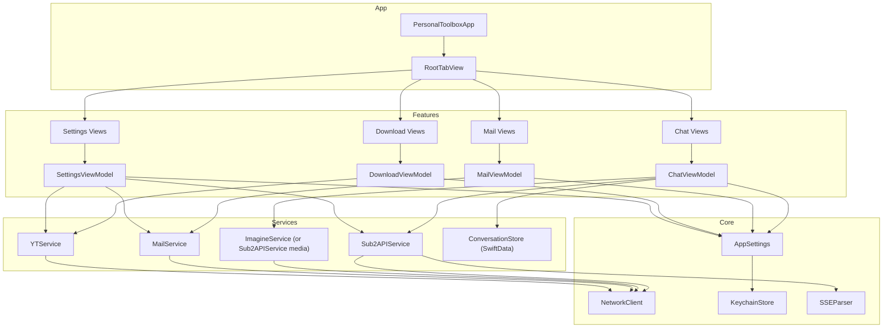
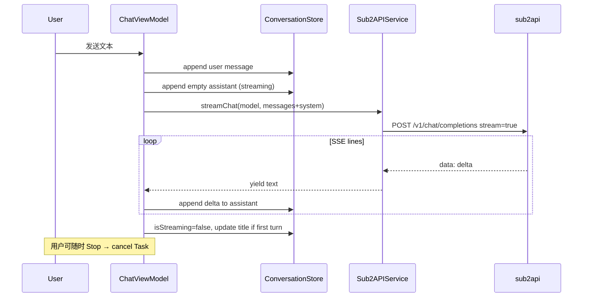
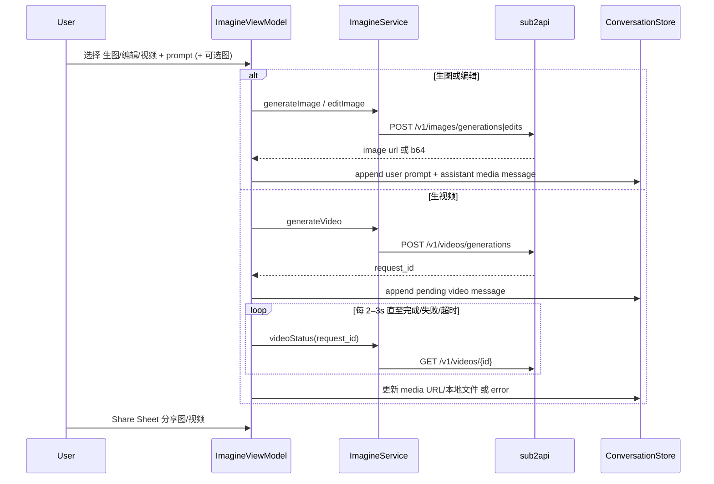
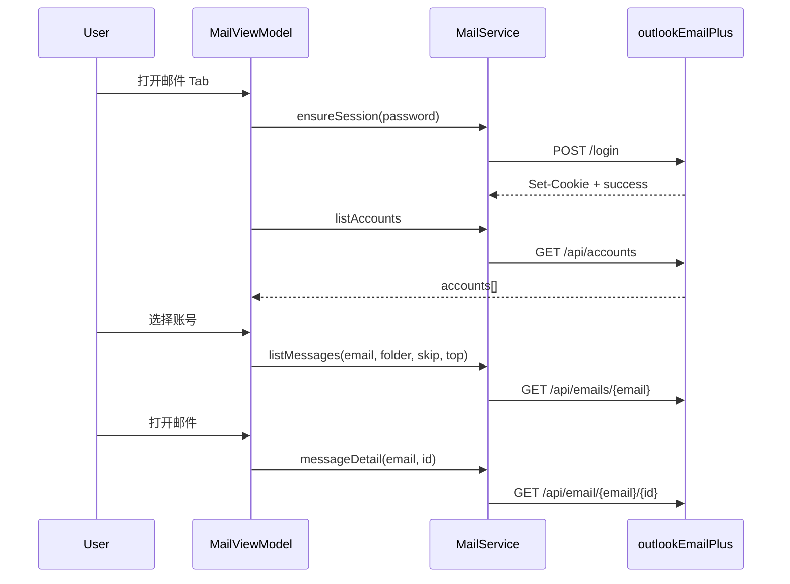
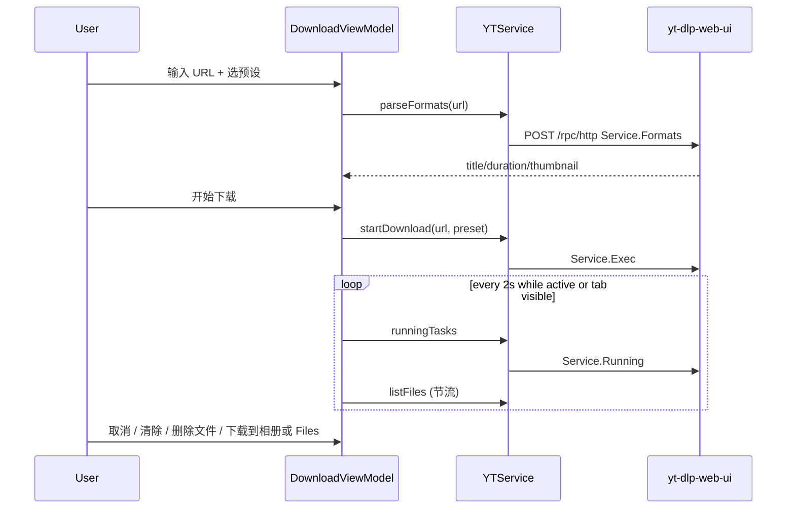
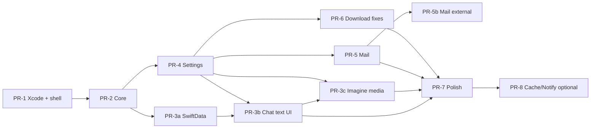

# PersonalToolbox — 个人 iOS 工具箱 App 设计文档

| 字段 | 值 |
|------|-----|
| **文档标题** | PersonalToolbox iOS App 技术设计 |
| **工作名** | PersonalToolbox |
| **作者** | design-doc-writer |
| **日期** | 2026-07-18 |
| **状态** | Draft（审查修订 + **用户决策已并入 2026-07-18**） |
| **平台** | iOS 17+，SwiftUI |
| **脚手架根路径** | `/root/PersonalToolbox/` |

---

## Overview

PersonalToolbox 是一款面向个人自托管场景的 iOS 工具箱，将本机已部署的三个服务统一到原生 App：

1. **AI 助手** — 通过 sub2api（OpenAI 兼容网关）调用 Grok **文本模型**（ChatGPT 风格流式对话，主路径），以及 **Grok Imagine 完整媒体能力**（生图 / 图编辑 / 生视频，助手 Tab 内次路径）  
2. **邮件** — 接入 outlookEmailPlus，随时查看本机邮箱池；**纯文本优先**，可选 HTML  
3. **下载** — 接入 yt-dlp-web-ui（yt-dow），解析视频、管理队列；导出走 **Share Sheet**  

现有脚手架已在 `/root/PersonalToolbox/PersonalToolbox/` 落地 Core / Theme / Models / Services 层；Features 与 App 入口目录为空，本文档在此基础上给出完整产品信息架构、UI 实现约定、模块契约与增量 PR 计划，**继承并完善现有代码，不推倒重来**。用户开放问题已于 2026-07-18 全部拍板并写入 Key Decisions K16–K20。

UI 强制对齐本地 Apple Design 规范副本：`/root/PersonalToolbox/DESIGN_REFERENCE.md`（源自 emilkowalski/skills `apple-design` / WWDC Designing Fluid Interfaces）。

---

## Background & Motivation

### 当前状态

| 服务 | 公网域名 | 本机代理 | 认证方式 |
|------|----------|----------|----------|
| sub2api | `https://sub2api.996616.xyz` | `127.0.0.1:18081` | `Authorization: Bearer <api_key>` |
| outlookEmailPlus | `https://mail.996616.xyz` | `127.0.0.1:5000` | 会话登录 **或** `X-API-Key` external API |
| yt-dlp-web-ui | `https://yt.996616.xyz` | `127.0.0.1:3033` | `POST /auth/login` → token，请求头 `X-Authentication` |

Web UI 可用但依赖浏览器、会话分散、移动端体验不一致。用户需要一部手机随时：聊 Grok、查验证码邮件、投递视频下载。

### 脚手架已实现（应继承）

```
PersonalToolbox/
  DESIGN_REFERENCE.md
  PersonalToolbox/
    Core/     AppSettings, KeychainStore, NetworkClient, SSEParser
    Theme/    AppleTheme (PressableButtonStyle, GlassCard, springs)
    Models/   ChatModels, MailModels, DownloadModels
    Services/ Sub2APIService, MailService, YTService
    Features/ Chat, Download, Mail, Settings  ← 空目录，待补 View/ViewModel
    App/      ← 空，待补入口
```

关键已实现能力：

- `Sub2APIService.streamChat` → SSE `POST /v1/chat/completions`，失败回退 non-stream  
- `YTService`：login + JSON-RPC + filebrowser  
- `MailService`：session cookie 路径 + external API 路径双轨  
- `AppleTheme`：press scale `0.97`、spring `response 0.35 / damping 0.86`、materials  
- `KeychainStore`：密钥 `kSecAttrAccessibleAfterFirstUnlockThisDeviceOnly`  
- `AppSettings` 默认 Base URL 已指向上述公网域名  

### 痛点

1. Features 无 UI，无法运行；**无 `.xcodeproj` / `Package.swift`**（PR-1 必须创建）  
2. `preferredModel` 默认 `grok-4.5` **与本机 sub2api 真实模型 ID 不一致**（见 Key Decisions）  
3. `YTService.parseTasks` 未对齐嵌套 `info`/`progress`/`output`；且 **`process_status` 语义易被误映射**（2=完成非错误）  
4. `YTService.downloadURL` **缺少 base64 路径编码**，对真实后端会 400  
5. 邮件鉴权双轨：默认会话登录已定；external 详情缺 `email` query  
6. 无会话持久化、无连通性探测 UI、无统一错误/空状态组件落地  

---

## Goals & Non-Goals

### Goals

- 四 Tab 原生 App：助手 / 邮件 / 下载 / 设置  
- ChatGPT 风格多会话**流式文本对话**（停止、复制、模型选择、系统提示词）— **主路径**  
- **Grok Imagine 完整媒体能力**（生图 + 图编辑 + 生视频 + 状态轮询），嵌在「助手」Tab 内作为**次路径**  
- 邮件账号列表 → 收件箱 → 详情（**纯文本优先**，可选 HTML），支持验证码快速复制  
- 视频 URL 解析 → 格式预设 → 队列轮询 → 文件列表/删除/**Share Sheet** 导出  
- 设置页配置三服务凭证，Keychain 存密，连通性探测  
- 视觉与动效严格遵循 Apple Design skill 的可执行约定  
- iOS 17+，SwiftUI，分层 App → Features → Services → Core  

### Non-Goals

- 多用户账号体系、云同步、团队协作  
- App Store 公开发布合规大套件（隐私清单完善可作为后续）  
- 完整 Outlook 写信 / 回复 / 附件上传  
- 播放列表批量下载、字幕管理、aria2 等扩展下载器  
- **首期本地推送通知**（下载完成 / 新邮件）— PR-8 可选延期  
- SSL Pinning  
- 修改三个后端服务本身（App 只消费现有 API）  

---

## Key Decisions

| # | 决策 | 理由 |
|---|------|------|
| K1 | **导航：4 Tab**（助手 / 邮件 / 下载 / 设置） | 三个对等主功能 + 设置；符合 HIG Tab 语义，避免深层汉堡菜单 |
| K2 | **默认文本模型：`grok-4.3`**（非 `grok-4.5`） | 本机 `/root/sub2api/backend/internal/pkg/xai/models.go` 默认列表首项为 `grok-4.3`；别名 `grok` / `grok-latest` → `grok-4.3`。用户口中的 grok4.5 映射为「当前最新 Grok 文本模型」，以 `/v1/models` 实时列表为准，设置页展示真实 model id |
| K3 | **邮件主路径：会话登录** | 个人「随时随地查看」需要 `GET /api/accounts` 列账号 + `GET /api/emails/{email}` 完整 UI；external API 是按 `email` 读取的机器接口，不提供账号列表，适合注册机。保留 external 作备选（单邮箱 + API Key） |
| K4 | **聊天持久化：SwiftData** | iOS 17+ 原生，与 `@Model` 会话/消息契合；密钥仍只进 Keychain |
| K5 | **网络：统一 `NetworkClient`** | 已有 REST + SSE + cookie session；扩展 timeout profile（SSE 长连接 vs 短 REST） |
| K6 | **下载轮询：2s** | 对齐 yt-dlp-web-ui 前端 `POLL_INTERVAL = 2000`；仅在 Download Tab 可见或有活跃任务时轮询 |
| K7 | **继承脚手架，增量补齐** | Services/Models/Theme 已可用；不重写网络层 |
| K8 | **外观：跟随系统 + 可选浅/深** | `preferredColorScheme`；材料用系统 material |
| K9 | **目标部署：公网 HTTPS 域名（默认可配）** | ATS 默认；证书由反代处理；**强烈建议** Tailscale/VPN/IP 白名单收紧暴露面（见 Security）；首期不做 SSL Pinning |
| K10 | **布局：iPhone-first TabView** | 首期不做 iPad 专属分栏/多窗口；大屏仍用 Tab + NavigationStack，系统自动适配 |
| K11 | **本地化：UI 文案以简体中文为主** | 系统控件跟随系统 locale；App 自定义字符串首期 `zh-Hans`；错误映射中文 |
| K12 | **生物识别锁：v1 默认关闭** | Face ID / 开机解锁为可选设置（默认 off）；密钥仍 Keychain `AfterFirstUnlockThisDeviceOnly` |
| K13 | **文件拉到设备：前台 URLSession + Share** | 后台 `URLSessionConfiguration.background` 明确为 Phase 2（非首期） |
| K14 | **设置是独立第 4 Tab** | 与 Alt E 结论一致；三服务凭证同等重要，不埋入助手齿轮 |
| K15 | **yt-dlp `process_status` 以本机后端为准** | `0` 等待 / `1` 下载中 / `2` 已完成（`percentage == "-1"` → UI 100%）/ `3` 失败；前端 label `4` 直播本后端未用 |
| K16 | **Grok Imagine：文本 + 生图 + 视频（完整）** | 用户决策。助手 Tab 内文本为主、创作次之；经 sub2api `PlatformGrok` 的 Images/Videos 端点，模型含 `grok-imagine*` 全系 |
| K17 | **邮件正文：纯文本优先** | Phase 1 展示 `content`；可选「查看 HTML」用 **禁用 JS** 的 WKWebView |
| K18 | **媒体/文件导出：系统 Share Sheet** | 下载文件与 Imagine 生成的图/视频默认 `ShareLink` / `UIActivityViewController`，不强制相册/Files 直存 |
| K19 | **本地通知 v1 不做** | PR-8 仍为可选延期；前台依赖 UI/haptics 反馈完成态 |
| K20 | **SSL Pinning：默认不做** | 证书轮换成本；依赖 HTTPS + ATS |

---

## Proposed Design

### 1. 产品信息架构

```
TabView
├── 助手 (sparkles)                    // 文本为主；Imagine 为次路径
│   ├── ChatListView                   // 会话列表（含带媒体附件的会话）
│   ├── ChatThreadView                 // 文本流式对话（push）
│   │   ├── ModelPickerSheet           // 文本模型
│   │   └── Composer: [+] 创作入口     // 打开 Imagine sheet
│   └── ImagineComposeSheet            // 生图 / 编辑 / 生视频（sheet）
│       └── 结果插入当前会话气泡 或 新建「创作」会话
├── 邮件 (envelope)
│   ├── AccountListView
│   ├── MessageListView
│   └── MessageDetailView              // 纯文本优先；可选 HTML
├── 下载 (arrow.down.circle)
│   ├── DownloadHomeView
│   └── FilesListView                  // Share Sheet 导出
└── 设置 (gearshape)
    ├── ServiceConfig / probes
    └── Appearance / Privacy
```

**导航路径约定（Spatial consistency）：**

| 场景 | 进入 | 退出 |
|------|------|------|
| 会话列表 → 对话 | NavigationStack push（从右） | 系统返回（从右滑回） |
| 模型选择 / Imagine 创作 | `.sheet` 自底向上 | 下拉 dismiss 同路径 |
| 新建下载确认 | 可选 confirmationDialog | 取消同路径消失 |
| 邮件详情 | push | pop |
| 设置子页 | push | pop |

禁止「进从右、出向下」的不对称转场。

### 2. 架构分层



**目录目标结构：**

```
PersonalToolbox/PersonalToolbox/
  App/
    PersonalToolboxApp.swift
    RootTabView.swift
  Core/
    AppSettings.swift          # 改默认模型、appearance、privacy flags
    KeychainStore.swift
    NetworkClient.swift        # 增加 TimeoutProfile
    SSEParser.swift
    Haptics.swift              # 新增：节制触觉
  Theme/
    AppleTheme.swift           # 扩展 reduced motion helpers
  Models/
    ChatModels.swift
    MailModels.swift
    DownloadModels.swift
    ConversationEntity.swift   # SwiftData @Model
  Services/
    Sub2APIService.swift
    MailService.swift
    YTService.swift
    ConversationStore.swift
  Features/
    Chat/
      ChatListView.swift
      ChatThreadView.swift
      ChatViewModel.swift
      MessageBubbleView.swift
      ComposerBar.swift
      ImagineComposeView.swift      # 创作 sheet
      ImagineViewModel.swift
      MediaBubbleView.swift         # 图/视频气泡
    Mail/
      AccountListView.swift
      MessageListView.swift
      MessageDetailView.swift
      MailViewModel.swift
    Download/
      DownloadHomeView.swift
      FilesListView.swift
      DownloadViewModel.swift
      TaskRowView.swift
    Settings/
      SettingsView.swift
      ServiceProbeRow.swift
      SettingsViewModel.swift
```

### 3. UI/UX — Apple Design 落地约定

对照 `DESIGN_REFERENCE.md`，把原则映射到 **SwiftUI + 现有 `AppleTheme`**：

#### 3.1 Response（触达即反馈）

- 所有主按钮使用已有 `PressableButtonStyle`（scale `0.97`，`easeOut 0.1s`）  
- 气泡长按菜单、发送按钮：`configuration.isPressed` 即时缩放，**禁止**仅在 action 完成时反馈  
- 列表行：系统 `List` + 默认 highlight  

#### 3.2 Interruptibility

- Sheet / 模型选择：系统 `.sheet` / `.presentationDetents`，支持中途下拉抓取  
- 流式生成：随时可点「停止」取消 `Task`，UI 立即进入 idle，不锁交互  
- 下载轮询 Task 在离开 Tab 时可挂起，返回时恢复  

#### 3.3 Springs

| 场景 | SwiftUI 动画 | 说明 |
|------|--------------|------|
| 默认 UI（气泡入场、列表插入） | `AppleTheme.spring` = `response: 0.35, dampingFraction: 0.86` | 接近 critically damped，轻微 settle |
| 更干脆控件 | `AppleTheme.snappy` = `0.28 / 0.9` | 发送后 composer 复位 |
| 动量/弹跳 | **仅** sheet 系统手势自带；自定义不主动 bounce | 对齐「momentum 才 bounce」 |
| Reduced motion | `accessibilityReduceMotion` → `Animation.easeOut(0.2)` 或无 transform | 见 3.7 |

#### 3.4 Materials（iOS 17 安全 API）

- `TabView` / 导航栏：依赖系统默认 translucent chrome；**不**使用未验证可用性的 `scrollEdgeEffect` 等新 API 作为基线  
- iOS 17 约定：`.toolbarBackground(.visible, for: .navigationBar)` / `.toolbarBackground(.ultraThinMaterial, for: .tabBar)` 按需；列表内容自然滚入系统材料下方  
- 若未来需要更新 API，一律 `#available` + 17 fallback（opaque bar 或 `toolbarBackground`）  
- 卡片：`GlassCard`（`.regularMaterial` + continuous corner 16）或 `appleCard()`  
- 聊天画布：`AppleTheme.canvas` = `systemGroupedBackground`  
- 用户气泡：`accentColor`；助手：`secondarySystemBackground`  
- **Direct Manipulation（DESIGN_REFERENCE §2）**：首期无自定义拖拽抽屉/卡片堆；交互依赖系统 sheet、List、ScrollView。自定义 1:1 手势 **out of scope**，不实现半吊子 rubber-band  

#### 3.5 Typography & 触控目标

- 全程 **SF Pro / system**（`.font(.body)` 等）  
- Dynamic Type：避免固定行高/固定气泡最大高度；气泡 `fixedSize(horizontal: false, vertical: true)`  
- **xxl 压力**：composer 随键盘 + Dynamic Type 增高，不裁切多行输入；长气泡纵向滚动，不横向溢出  
- 邮件主题 `.headline`，预览 `.subheadline` + secondary  
- **最小触控高度 44pt**：格式 chip、停止按钮、发送按钮、Tab 项均满足 HIG 44×44  

#### 3.6 Spatial consistency

- 见导航表；自定义 transition 一律对称  
- 空状态 / 错误态使用同一 `EmptyStateView` 组件，避免每页一套布局语言  

#### 3.7 Reduced motion

```swift
@Environment(\.accessibilityReduceMotion) private var reduceMotion

var insertAnimation: Animation? {
    reduceMotion ? .easeOut(duration: 0.2) : AppleTheme.spring
}
```

- 气泡入场：reduce 时仅 opacity，无 offset  
- 禁止装饰性循环动画  

#### 3.8 Haptics（有节制）

| 事件 | 反馈 |
|------|------|
| 发送消息 | `UIImpactFeedbackGenerator(style: .light)` |
| 流式完成 | `UINotificationFeedbackGenerator().notificationOccurred(.success)` |
| 错误 | `.error` |
| 复制验证码 / 文本 | `.success` 轻通知 |
| 下载完成（App 前台） | `.success` |
| 滚动、打字、轮询 | **无** |

#### 3.9 八原则映射

| 原则 | 产品落点 |
|------|----------|
| Purpose | 三件事：聊、邮、下；不做无关社交 |
| Agency | 停止生成、取消下载、模型自选、邮件双轨鉴权可选 |
| Responsibility | 密钥 Keychain；可选截图隐藏；可选 Face ID；AI 不伪造成系统 |
| Familiarity | ChatGPT 气泡布局；Mail 类系统邮件列表；Tab 图标 SF Symbols |
| Flexibility | Dynamic Type、浅/深色、双邮件鉴权、模型可配、iPhone-first |
| Simplicity | 一级 Tab 直达；高级选项（温度、system prompt）沉入设置 |
| Craft | 统一圆角 14/16/18、弹簧参数、材料层级、44pt 触控 |
| Delight | 流式逐字 + 完成轻触；验证码一键复制；首次连通成功的简短状态确认（非 confetti） |

#### 3.10 Accessibility checklist（PR-7 验收）

| 项 | 要求 |
|----|------|
| Dynamic Type | 助手气泡 / composer / 邮件行在最大内容尺寸下可读、可滚动、不重叠 |
| VoiceOver | 流式中的助手气泡：`accessibilityLabel` 含「正在生成」；完成后播报「回复完成」；进度条有 `accessibilityValue` 百分比 |
| 触控 | chip / 停止 / 发送 ≥ 44pt |
| Reduce Motion | 见 3.7 |
| Reduce Transparency | 材料卡片在系统「降低透明度」下可读（系统 material 自动处理；自绘 glass 需提高不透明度） |
| 对比度 | 次要文案用 `.secondary`，不自造低对比灰 |

### 4. 关键屏幕线框 + 组件清单

#### 4.1 助手 — 会话列表

```
┌─────────────────────────────┐
│ 助手              [+] 新建   │  large title + toolbar
├─────────────────────────────┤
│ ○ 关于 Swift 并发…    昨天  │  title + 相对时间
│ ○ 解释这段日志…       周一  │
│                             │
│ (空) EmptyStateView         │  symbol: bubble.left.and.bubble.right
│      开始一段新对话          │
└─────────────────────────────┘
```

**组件：** `ChatListView`, `ConversationRow`, `EmptyStateView`, `PressableButtonStyle` 新建按钮  

#### 4.2 助手 — 对话线程

```
┌─────────────────────────────┐
│ 〈 会话     grok-4.3  ▾     │  模型 chip → sheet
├─────────────────────────────┤
│         ┌──────────────┐    │
│         │ 用户消息     │    │  右对齐 accent 气泡
│         └──────────────┘    │
│ ┌──────────────┐            │
│ │ 助手流式…▋   │            │  左对齐 secondary 气泡
│ └──────────────┘            │
│                             │
├─────────────────────────────┤
│ [停止]  或  [输入框] [↑]    │  safeAreaInset bottom
└─────────────────────────────┘
```

**组件：** `ChatThreadView`, `MessageBubbleView`（长按 Copy）, `ComposerBar`, `StreamingCursor`, `ModelPickerSheet`  

**交互：**  
- 发送：optimistic 插入 user + 空 assistant（`isStreaming=true`），SSE 追加 content  
- 停止：cancel Task，保留已生成文本，`isStreaming=false`  
- 多轮：完整 history（含可选 system）发往 API  

#### 4.3 邮件 — 账号 / 列表 / 详情

```
账号列表                    消息列表                     详情
┌──────────────┐    ┌──────────────┐    ┌──────────────┐
│ 邮件         │    │ inbox  junk  │    │ 主题         │
│ a@x.com   ›  │ →  │ From  主题   │ →  │ From / 时间  │
│ b@y.com   ›  │    │ preview…     │    │ ───────────  │
└──────────────┘    └──────────────┘    │ 正文/HTML    │
                                        │ [复制验证码] │
                                        └──────────────┘
```

**组件：** `AccountListView`, `MessageListView`（folder segmented）, `MessageDetailView`（`AttributedString` 或受限 `WKWebView` 渲染 html）, `VerificationCodeBanner`  

#### 4.4 下载

```
┌─────────────────────────────┐
│ 下载                        │
│ [URL 输入框            ]    │
│ 预设: 最佳 4K 1080 720 480  │  横向 chip
│ [解析] [开始下载]           │
│ ──────── 进行中 ────────    │
│ title  ████░ 45%  2MB/s     │
│ ──────── 文件 ────────      │
│ video.mp4  120MB  [↓] [🗑]  │
└─────────────────────────────┘
```

**组件：** `DownloadHomeView`, `FormatChipBar`, `TaskRowView`, `FilesListView`, `PrimaryButtonLabel`  

#### 4.5 设置

分区 Form：AI / 邮件 / 下载 / 外观 / 关于  
每区：Base URL、凭证 SecureField、默认模型、**测试连接** 按钮 + 状态灯  

---

## API / Interface Changes

App 侧不改后端；以下为客户端消费契约与 Service 改造点。

### 1) sub2api（OpenAI 兼容）

| 方法 | 路径 | 认证 | 用途 |
|------|------|------|------|
| GET | `/v1/models` | Bearer | 模型列表 |
| POST | `/v1/chat/completions` | Bearer | 流式/非流式聊天 |

**请求体（已有 `ChatCompletionRequest`）：**

```json
{
  "model": "grok-4.3",
  "messages": [
    {"role": "system", "content": "..."},
    {"role": "user", "content": "..."},
    {"role": "assistant", "content": "..."}
  ],
  "stream": true,
  "temperature": 0.7
}
```

**SSE：** `data: {"choices":[{"delta":{"content":"..."}}]}` … `data: [DONE]`  
解析：`SSEParser.deltas(from:)`  

**本机默认 xAI 模型 ID**（`models.go`）：

- **文本（聊天选择器）：** `grok-4.3`, `grok-build-0.1`, `grok-4.20-0309-reasoning`, `grok-4.20-0309-non-reasoning`, `grok-4.20-multi-agent-0309`  
- **Imagine（创作选择器，K16）：**  
  - 生图：`grok-imagine`, `grok-imagine-image`, `grok-imagine-image-quality`  
  - 编辑：`grok-imagine-edit`  
  - 视频：`grok-imagine-video`, `grok-imagine-video-1.5`  
  - 网关归一：`grok-imagine` 在 images 端点可被映射为 `grok-imagine-image-quality`（`normalizeGrokMediaModelForEndpoint`）

**`AppSettings` 改造：**

```swift
// 前
preferredModel = ... ?? "grok-4.5"
static let defaultModels = ["grok-4.5", "grok-4.3", ...]

// 后
preferredModel = ... ?? "grok-4.3"
static let defaultTextModels = [
  "grok-4.3",
  "grok-build-0.1",
  "grok-4.20-0309-reasoning",
  "grok-4.20-0309-non-reasoning",
  "grok-4.20-multi-agent-0309"
]
static let defaultImagineImageModels = [
  "grok-imagine-image-quality", "grok-imagine-image", "grok-imagine"
]
static let defaultImagineEditModels = ["grok-imagine-edit"]
static let defaultImagineVideoModels = [
  "grok-imagine-video-1.5", "grok-imagine-video"
]
preferredImagineImageModel = ... ?? "grok-imagine-image-quality"
preferredImagineVideoModel = ... ?? "grok-imagine-video-1.5"
```

**`Sub2APIService` 文本增量：**

- `listModels` 已有；Settings 探测直接复用  
- `streamChat`：用 `withTaskCancellationHandler` / 取消底层 `URLSession` task  
- **Fallback 规则：** 仅当 stream **零 delta** 时允许 non-stream 整段回退；已有 partial 禁止 fallback  
- **模型分流：** 文本选择器 `!id.contains("imagine")`；Imagine 选择器仅 `imagine` 系  

#### 1b) Grok Imagine 媒体 API（K16，用户决策）

路由源：`gateway.go` — `PlatformGrok` → `GrokImages` / `GrokVideoGeneration` / `GrokVideoStatus`。  
实现：`handler/grok_media.go` + `service/grok_media.go`。

| 方法 | 路径 | 认证 | 用途 |
|------|------|------|------|
| POST | `/v1/images/generations` | Bearer | 文生图 |
| POST | `/v1/images/edits` | Bearer | 图编辑（JSON 或 multipart；可含 `image` / `mask`） |
| POST | `/v1/videos/generations` | Bearer | 文生视频（异步，返回 request id） |
| GET | `/v1/videos/:request_id` | Bearer | 视频任务状态 / 结果 |

**生图请求（OpenAI 兼容风格，网关解析字段）：**

```json
{
  "model": "grok-imagine-image-quality",
  "prompt": "一只赛博朋克风格的猫",
  "n": 1,
  "size": "1024x1024"
}
```

**图编辑：** 同鉴权；body 含 `model`（默认/选择 `grok-imagine-edit`）、`prompt`、输入图（`image` URL / data URL / multipart 文件）与可选 `mask`。

**生视频：**

```json
{
  "model": "grok-imagine-video-1.5",
  "prompt": "海浪拍打礁石，电影感",
  "size": "1280x720"
}
```

响应中提取 `request_id`（路径兼容：`request_id` / `id` / `data.request_id` / `video.request_id` 等，见 `extractGrokMediaVideoRequestID`）。

**视频状态轮询：** `GET /v1/videos/{request_id}`，间隔建议 **2–3s**，超时上限 **5–10 min**（可配置）；完成态解析 URL 或可下载资源；失败展示上游 `error`。

**客户端 `ImagineService`（可并入 `Sub2APIService` 扩展）：**

```swift
func generateImage(baseURL:apiKey:model:prompt:n:size:) async throws -> [ImagineAsset]
func editImage(baseURL:apiKey:model:prompt:imageData:maskData?:) async throws -> [ImagineAsset]
func generateVideo(baseURL:apiKey:model:prompt:size:) async throws -> String // request_id
func videoStatus(baseURL:apiKey:requestID:) async throws -> VideoJobStatus
// VideoJobStatus: pending | processing | completed(url/data) | failed(message)
```

**结果落会话：** 生成成功后插入一条 `assistant` 消息，`content` 可为简短 caption；媒体以 `mediaKind` + 本地缓存路径 / 远程 URL 存储（见 Data Model）。气泡支持 **Share Sheet**（K18）与长按保存。  

### 2) outlookEmailPlus

#### 推荐：会话登录路径（默认）

| 步骤 | 方法 | 路径 | 说明 |
|------|------|------|------|
| 登录 | POST | `/login` | body `{ "password" }`，Set-Cookie session |
| 账号列表 | GET | `/api/accounts` | query: `page`, `page_size`, `search`… |
| 邮件列表 | GET | `/api/emails/{email}` | `folder`, `skip`, `top` |
| 邮件详情 | GET | `/api/email/{email}/{message_id}` | 含 content / html |

路由源码：

- `/root/outlookEmailPlus/outlook_web/routes/pages.py` → `/login`  
- `/root/outlookEmailPlus/outlook_web/routes/accounts.py` → `/api/accounts`  
- `/root/outlookEmailPlus/outlook_web/routes/emails.py` → `/api/emails/...`, `/api/email/...`  

登录成功：`{"success": true, "message": "登录成功"}`；失败 401 + `error.message`。  
`MailService` 已实现 cookie session + 401 重登。

**账号列表分页注意：** `api_get_accounts` 支持 `page`/`page_size`（默认 50，max 100）。客户端应循环或「加载更多」；`MailJSONHelper.parseAccounts` 已容忍多种 key。

#### 备选：External API

| 方法 | 路径 | Header / Query |
|------|------|----------------|
| GET | `/api/external/health` | `X-API-Key` |
| GET | `/api/external/messages` | `X-API-Key`；query: **`email` 必填**（或 `claim_token`）, `folder`, `skip`, `top`≤50 |
| GET | `/api/external/messages/{message_id}` | `X-API-Key`；query: **`email` 必填**（或 `claim_token`）, 可选 `folder` |
| GET | `/api/external/verification-code` | 同上 common args |

**详情契约（代码核实）：** `api_external_get_message_detail` 调用 `_parse_external_common_args()`，经 `resolve_external_mail_scope` 要求 **`email` 或 `claim_token`** 之一能解析出邮箱，否则参数错误。个人工具箱不使用 claim 流，故 **详情必须带 `email` query**。

脚手架缺口：`MailService.externalMessageDetail(baseURL:apiKey:messageID:)` **未传 `email`**，属 bug，PR-5b 必须改为：

```swift
func externalMessageDetail(
    baseURL: String,
    apiKey: String,
    email: String,           // 新增必填
    messageID: String,
    folder: String = "inbox"
) async throws -> MailMessage
// GET /api/external/messages/{id}?email=...&folder=...
```

文档：`/root/outlookEmailPlus/注册与邮箱池接口文档.md`  
**限制：** 必须已知 `email`；Key 可能绑定 `allowed_emails`；公网模式有限流/功能开关。  
设置中 `mailUseExternalAPI == true` 时走此路径：账号列表改为「默认邮箱 + 收藏邮箱列表」。

**`AppSettings` external 完备性：**

| 字段 | 说明 |
|------|------|
| `mailDefaultEmail` | UD；external 模式下必填 |
| `mailFavoriteEmails` | UD `[String]` 可选收藏 |
| `isMailConfigured` | external 时：**API Key 非空且 `mailDefaultEmail` 非空**（今日脚手架只查 Key，需改） |

#### 产品默认

```
mailUseExternalAPI = false  // 会话登录
```

UI 文案：设置 → 邮件 → 「认证方式」Picker：`管理密码登录` / `外部 API Key`。

### 3) yt-dlp-web-ui

| 方法 | 路径 | 认证 | 说明 |
|------|------|------|------|
| GET | `/healthz` | 无 | 纯文本 `ok`（可选探活） |
| POST | `/auth/login` | 无 | body `{username,password}` → JSON string token |
| GET | `/api/v1/version` | `X-Authentication` | `{ ytdlpVersion, rpcVersion }` |
| POST | `/rpc/http` | 同上 | JSON-RPC |
| POST | `/filebrowser/downloaded` | 同上 | 文件列表 |
| POST | `/filebrowser/delete` | 同上 | `{ "path": "..." }` |
| GET | `/filebrowser/d/{path}?token=` | token query 或 header | 下载到设备 |

**RPC methods：**

| method | params | result |
|--------|--------|--------|
| `Service.Formats` | `[{ "URL": url }]` | metadata（title, duration, thumbnail…） |
| `Service.Exec` | `[{ "URL", "Params", "Path", "Rename" }]` | `true` |
| `Service.Running` | `[]` | `[]task` |
| `Service.Kill` | `[id]` | bool |
| `Service.Clear` | `[id]` | bool |

**真实 task JSON 形状**（`/root/yt-dlp-web-ui/backend/main.go`）：

```json
{
  "id": "...",
  "info": {
    "url": "https://...",
    "title": "...",
    "thumbnail": "...",
    "resolution": "...",
    "filesize_approx": 0,
    "created_at": "..."
  },
  "progress": {
    "percentage": "45.2%",
    "process_status": 1,
    "speed": 1234567.0
  },
  "output": { "savedFilePath": "/path/to/file" },
  "error": ""
}
```

**`process_status` 权威语义**（`main.go` enqueue/runQueued + 前端 `statusLabels` / `isTaskComplete`）：

| 值 | 含义 | `percentage` | UI |
|----|------|--------------|-----|
| `0` | 等待中 pending | `"0%"` | 排队 |
| `1` | 下载中 running | 如 `"45.2%"` | 进度条 |
| `2` | **已完成** completed | **`"-1"`**（前端映射为 100%） | 完成 chip |
| `3` | **失败** failed | 任意；读 `error` 字符串 | 错误文案 |
| `4` | 直播（前端 label 存在） | — | **本后端未写入**；忽略 |

> ⚠️ 旧版设计误写「2=error / 3=完成」——**已作废**。实现必须以本表为准。

**`YTTask` 判定（禁止仅靠自由文本 status 启发式）：**

```swift
var isActive: Bool { processStatus == 0 || processStatus == 1 }
var isCompleted: Bool { processStatus == 2 || percentageRaw == "-1" }
var isFailed: Bool { processStatus == 3 }
var progress01: Double {
    if percentageRaw == "-1" || processStatus == 2 { return 1 }
    // parse "45.2%" → 0.452
}
```

**`YTService.parseTasks` 必须改造为优先读嵌套结构：**

```swift
// 关键改造点（伪代码）
let info = row["info"] as? [String: Any]
let progress = row["progress"] as? [String: Any]
let url = info?["url"] as? String ?? row["url"] as? String
let title = info?["title"] as? String ?? url
let pctString = progress?["percentage"] as? String // "45.2%" or "-1"（完成）
let processStatus = progress?["process_status"] as? Int // 0/1/2/3
let speedNum = progress?["speed"] as? Double // bytes/s → "1.2 MB/s"
let filepath = (row["output"] as? [String: Any])?["savedFilePath"] as? String
let error = row["error"] as? String
```

**文件下载 URL：脚手架 `downloadURL` 尚未生产可用（必须修）**

后端 `handleFileDownload`（`main.go` ~757–768）要求路径段为：

1. 原始文件系统 path 的 **UTF-8 字节 → Base64 StdEncoding**  
2. 再 **URL path-escape**（`encodeURIComponent`）  
3. 组成 `GET /filebrowser/d/{encoded}?token=...`（token 亦可放 `X-Authentication`）

前端参考 `encodedPath`：

```js
// frontend/app.js
function encodedPath(path) {
  const bytes = new TextEncoder().encode(String(path || ""));
  let binary = "";
  bytes.forEach((b) => { binary += String.fromCharCode(b); });
  return encodeURIComponent(btoa(binary));
}
```

脚手架现状只做 path segment percent-encode → 服务端 base64 decode 失败 → **HTTP 400 `invalid file path`**。  
**不得**在文档或 PR 描述中声称 `downloadURL` 已可用。

```swift
// 目标实现
func downloadURL(baseURL: String, path: String) throws -> URL {
    guard let token else { throw NetworkError.unauthorized }
    let pathData = Data(path.utf8)
    let b64 = pathData.base64EncodedString() // StdEncoding
    let encoded = b64.addingPercentEncoding(withAllowedCharacters: .urlPathAllowed) ?? b64
    // "{base}/filebrowser/d/{encoded}?token={token}"
}
// 验收：用 listFiles 返回的真实 path 构造 URL，HEAD/GET 不得 400
```

**Exec 格式串：对齐生产前端 `qualityFormats`（非脚手架简化版）**

脚手架 `YTFormatOption.presets` 使用简化 `-f`（如 `bv*+ba/b`）。设计选择 **复制前端字面量**，避免与 Web UI 画质结果不一致：

| id | label | format（摘自 `frontend/app.js` `qualityFormats`） |
|----|-------|--------------------------------------------------|
| best | 最佳 | `bv*[ext=mp4]+ba[ext=m4a]/b[ext=mp4]/bv*+ba/b` |
| 4k / 2160 | 4K | `bv*[height<=2160][ext=mp4]+ba[ext=m4a]/b[height<=2160][ext=mp4]/bv*[height<=2160]+ba/b[height<=2160]` |
| 1080 | 1080P | （同上 height≤1080 链） |
| 720 | 720P | （同上 height≤720 链） |
| 480 | 480P | （同上 height≤480 链） |

请求壳参数保持：

```json
{
  "URL": "<url>",
  "Params": ["--no-playlist", "-f", "<qualityFormats 值>", "--merge-output-format", "mp4"],
  "Path": "",
  "Rename": ""
}
```

后端 `sanitizeParams` 仅放行 `-f` 与 `--merge-output-format`（mp4/mkv/webm），并强制 `--no-playlist`。

---

## Data Model Changes

### SwiftData（新增）

```swift
@Model
final class ConversationEntity {
    @Attribute(.unique) var id: UUID
    var title: String
    var updatedAt: Date
    var model: String
    @Relationship(deleteRule: .cascade, inverse: \MessageEntity.conversation)
    var messages: [MessageEntity]
}

@Model
final class MessageEntity {
    @Attribute(.unique) var id: UUID
    var roleRaw: String          // system|user|assistant
    var content: String          // 文本或 caption
    var createdAt: Date
    var mediaKindRaw: String?    // nil | image | video
    var mediaRemoteURL: String?  // 上游 URL（若有）
    var mediaLocalRelativePath: String? // Application Support/Imagine/...
    var mediaRequestID: String?  // 视频任务 id（轮询中）
    var conversation: ConversationEntity?
}
```

运行时 `ChatConversation` / `ChatMessage` 与 Entity 双向映射；`isStreaming` **不持久化**。  
Imagine 媒体文件写入 App 沙盒 `Application Support/Imagine/`；会话删除时可选级联删文件（v1：删除会话时清理关联本地文件）。

### 本地缓存（邮件摘要，可选 Phase 2）

- `UserDefaults` 或文件缓存最近一次 `AccountList` + 当前邮箱 `MessageList` 摘要（无 body）  
- 弱网展示 stale + 工具栏「离线缓存」角标  
- 密钥绝不进缓存文件  

### AppSettings 增量字段

| 字段 | 存储 | 默认 |
|------|------|------|
| `preferredModel` | UD | **`grok-4.3`** |
| `preferredImagineImageModel` | UD | `grok-imagine-image-quality` |
| `preferredImagineVideoModel` | UD | `grok-imagine-video-1.5` |
| `appearance` | UD | `system` / `light` / `dark` |
| `hideSensitiveInAppSwitcher` | UD | `false` |
| `requireBiometricUnlock` | UD | `false`（K12，用户确认默认关闭） |
| `mailDefaultFolder` | UD | `inbox` |
| `mailDefaultEmail` | UD | `""`（external 模式必填） |
| `mailFavoriteEmails` | UD | `[]` |
| `ytDefaultPresetID` | UD | `best` |
| `ytSessionToken` + `ytTokenSavedAt` | Keychain / UD | 可选；TTL **7 天** |
| 现有 Base URL / 凭证 | UD + Keychain | 已有 |

---

## 模块详细设计

### A. AI 助手

#### 用户流程



#### Chat 实现契约（工程师可直接编码）

| 主题 | 约定 |
|------|------|
| **System prompt** | 每次请求在 messages 数组**最前**注入一条 `role=system`，内容 = `AppSettings.systemPrompt`（全局）。会话级 override **v1 不做**（Open Question 原 #5 关闭为「全局 only」）；不写入 SwiftData |
| **历史窗口** | 发送时取当前会话 messages：**去掉 streaming 占位后**，保留最近 **N=40 条** user/assistant 轮次（可配置常量 `chatMaxHistoryMessages = 40`）。若单条超长，截断该条 content 尾部保留约 **12k 字符**（粗粒度，非 tokenizer）。system 不计入 N |
| **渲染** | Phase 1：**纯文本** `Text` + 可选 `textSelection(.enabled)`。Markdown / 代码块高亮为 Phase 2。复制 = 剪贴板纯文本 |
| **标题** | 首条 **user** 消息生成：取前 **24 个字符**（去换行），空则「新对话」。用户可在列表行 context menu 重命名（可选 PR-3b） |
| **停止** | cancel `streamTask`；保留已生成 partial；`isStreaming=false` |
| **中途错误** | 若 **已收到 ≥1 个 delta**：保留 partial，设 `errorMessage`，**禁止**再走 non-stream fallback（避免双重内容）。若 **零 delta** 且 stream 硬失败：允许一次 non-stream fallback（与现有 Service 行为一致） |
| **空 assistant 行** | 用户发送后立即插入 `content=""` + `isStreaming=true`；若最终 content 仍空且错误，删除该行或替换为错误提示气泡 |
| **SwiftData 容器** | 在 `PersonalToolboxApp`：`WindowGroup` + `.modelContainer(for: [ConversationEntity.self, MessageEntity.self])`。v1 **无迁移版本策略**（破坏性 schema 变更可清库；DEBUG 提供重置） |
| **未配置引导** | EmptyState「配置 API Key」主按钮 deep-link 到设置 Tab（`selectedTab = .settings`）；PR-3b **硬依赖** PR-4 的设置写入路径，或 PR-3b 内嵌最小 API Key 表单（二选一，推荐依赖 PR-4） |
| **Imagine 入口** | Composer 左侧 `+` / 「创作」→ `ImagineComposeSheet`（segment：生图 / 编辑 / 视频）；**不**把 imagine 模型混入文本 model picker |

#### A2. Imagine 用户流程（K16）



**UX 约定：**

| 项 | 约定 |
|----|------|
| 主次 | 文本聊天为主；创作 sheet 为次（K16） |
| 结果归属 | 默认插入**当前会话**；若无活动会话则新建标题「创作 · 前 24 字」 |
| 编辑图源 | PhotosPicker / 文件；压缩后 multipart 或 data URL（注意 body limit） |
| 进度 | 生图：ProgressView + 不可重复提交；视频：气泡内环形进度 + 可取消轮询 |
| 导出 | **Share Sheet only**（K18）；不强制写相册（可在分享目标中由用户选「存储到照片」） |
| 权限 | 读相册需 `NSPhotoLibraryUsageDescription`（Info.plist，PR-1/3c） |
| 错误 | 403 组未开图生权限、上游安全过滤、超时 — 中文提示 |

#### ViewModel 状态机

```
idle ──send──► streaming ──finish/error/cancel──► idle
                  │
                  └── stop ──► idle (partial content kept)

idle ──imagine──► mediaRunning ──done/fail/cancel──► idle
```

```swift
@MainActor
final class ChatViewModel: ObservableObject {
    @Published var conversations: [ChatConversation]
    @Published var active: ChatConversation?
    @Published var input: String
    @Published var isStreaming: Bool
    @Published var errorMessage: String?
    @Published var availableModels: [String] // 仅文本
    private var streamTask: Task<Void, Never>?
    private var receivedAnyDelta = false
    // send / stop / newConversation / selectModel / loadModels
}

@MainActor
final class ImagineViewModel: ObservableObject {
    enum Mode: String, CaseIterable { case image, edit, video }
    @Published var mode: Mode
    @Published var prompt: String
    @Published var selectedImageData: Data?
    @Published var isRunning: Bool
    @Published var progressNote: String?
    // generate / cancelVideoPoll / attachToConversation
}
```

#### 错误与空状态

| 状态 | UI |
|------|-----|
| 未配置 API Key | EmptyState + 跳转设置（或内嵌配置） |
| 401 | 「未授权，请检查 API Key」 |
| 网络失败 | inline banner + 重试（重试 = 重新发送最后一条 user，不重复插入 user） |
| 模型不存在 | 展示服务端 error.message |
| 无会话 | EmptyState「开始一段新对话」 |
| Imagine 超时 | 气泡标失败 + 可重试（视频沿用同一 request_id 再 poll 或重新提交） |
| 媒体过大 | 下载到沙盒失败时提示；优先流式写盘 |

#### Service / 分层 diff

| 文件 | 改造 |
|------|------|
| `AppSettings.swift` | 默认模型 `grok-4.3`；imagine 默认模型字段 |
| `ChatModels.swift` | Conversation 默认 model；`chatMaxHistoryMessages`；`MediaKind` |
| `Sub2APIService.swift` | stream 取消；零 delta fallback；文本/imagine 模型分流 |
| 新增或扩展 media API | `generateImage` / `editImage` / `generateVideo` / `videoStatus` |
| 新增 `ConversationStore.swift` | SwiftData CRUD + 媒体字段（PR-3a 可先文本，3c 扩媒体列） |
| Features/Chat/* | 文本 UI（PR-3b）+ Imagine UI（PR-3c） |

---

### B. 邮件

#### 用户流程（会话登录）



#### ViewModel 状态机

```
unconfigured → loadingAccounts → accountsReady
                     │ 401/error
                     ▼
                  error / needLogin
accountsReady → loadingMessages → messagesReady → messageDetail
```

#### 验证码体验

- 详情页默认渲染 **纯文本 `content`**（K17）；工具栏「查看 HTML」可选打开禁用 JS 的 WKWebView（`html_content`）  
- 对 `content` 跑简单正则 `\b(\d{4,8})\b` 启发式；或后续接 session 路径 `/api/emails/{email}/extract-verification`  
- external 模式可调 `GET /api/external/verification-code`  
- 命中则顶部 Banner「验证码 123456」+ 一键复制 + haptic success（剪贴板可设短过期）  

#### 错误与空状态

| 状态 | UI |
|------|-----|
| 未配置密码 | EmptyState → 设置 |
| 登录失败 / 限流 429 | 展示服务端 message（含「N 秒后重试」） |
| 无账号 | 「邮箱池为空」 |
| 收件箱空 | 「暂无邮件」 |
| 离线 | 展示缓存摘要（若有）+ 重试 |

#### Session 重登与分页算法（具体）

**401 重登（防递归）：**

```
func withSessionRetry<T>(_ work: () async throws -> T) async throws -> T {
  try await ensureSession(...)          // 内部：若 sessionLoggedIn 则跳过
  do { return try await work() }
  catch NetworkError.unauthorized {
    sessionLoggedIn = false
    try await login(...)                // 仅再登录一次
    return try await work()             // 第二次失败直接抛出，禁止再递归
  }
}
```

- **每个 call chain 最多 1 次 re-login**（今日 `listAccounts` 无界递归必须改掉）  
- **429 `LOGIN_RATE_LIMITED`：** 不重试；把 `error.message`（含 remaining 秒）抛到 UI  
- **Single-flight login：** actor 内 `private var loginTask: Task<Void, Error>?`；并发 `ensureSession` 共享同一 Task，Settings 探测与 Mail Tab 不会双发 login 撞限流  

**账号分页：**

- 首屏：`page=1`, `page_size=50`  
- UI「加载更多」：`page += 1` 直到 `page >= total_pages`（响应字段以 API 为准；解析 `total`/`total_pages`/`has_more`）  
- **禁止**静默 while 循环拉全库（账号池可能很大）；可选设置「预取最多 5 页」封顶  

**探测副作用：** Settings「测试连接」调用同一 `ensureSession`；成功仅标记 `sessionLoggedIn=true`，**不**清 cookie；失败不无故 `HTTPCookieStorage.shared.removeCookies`。

#### Service diff

| 文件 | 改造 |
|------|------|
| `MailService.swift` | `withSessionRetry` 单次重登；single-flight login；`listAccounts(page:)`；可选 `extractVerification`；external detail 传 `email` |
| `MailModels.swift` | `hasMore` / `totalPages`；日期解析为 `Date?` |
| `AppSettings.swift` | `mailDefaultEmail`、external 完备 `isMailConfigured` |
| Features/Mail/* | 全量新增 |

**关于 external vs session 的明确结论：**

> **个人工具箱默认会话登录。** External API 面向注册机（claim-random + 验证码），不列账号、依赖 Key 白名单，不适合「打开 App 就看所有邮箱」。仅当用户只有 API Key、无管理密码时切换 external，并要求配置默认 `email`。

---

### C. 下载

#### 用户流程



#### ViewModel 状态机

```
idle → parsing → readyToDownload → enqueueing → polling
polling → idle (no active tasks)
任意 → error (toast/banner)
```

#### 轮询策略

- 间隔 **2s**（对齐 `frontend/app.js` `POLL_INTERVAL`）  
- `scenePhase == .active` 且（本 Tab 选中 **或** `tasks.contains(where: \.isActive)`）才轮询  
- 后台：停止 timer，回前台立即 refresh  
- 弱网：失败不重置 token，连续 3 次 401 才 relogin  

#### 文件下载到设备

- **必须先修复** `downloadURL` 为 base64 StdEncoding + path escape（见 API 节）；修复前禁用「下载到设备」按钮——脚手架现状**不可用**  
- 前台 `URLSession.download` + **Share Sheet**（K13 + K18，用户决策）  
- 后台 background session：**Phase 2 only**  
- 日志/分享前 **剥离 query `token=`**，禁止把带 token 的 URL 写入 Logger  

#### Auth / Token TTL

- 后端 `sessionTTL = 7 * 24 * time.Hour`（`main.go`，已核实）  
- 可选 Keychain 持久化 token + `ytTokenSavedAt`；超过 ~6.5 天可主动 re-login；任意 401 清 token 后 re-login  
- Settings「注销全部会话」：清 yt token、清 mail cookies、重置 `sessionLoggedIn`  

#### Service diff

| 文件 | 改造 |
|------|------|
| `YTService.swift` | **重写 `parseTasks`**；**修正 `process_status` 0/1/2/3**；**重写 `downloadURL` base64**；speed 格式化；token Keychain 可选；`logout()` |
| `DownloadModels.swift` | `processStatus: Int`；`percentageRaw`；`isActive`/`isCompleted`/`isFailed` 基于 int |
| `YTFormatOption.presets` | 替换为前端 `qualityFormats` 字面量 |
| Features/Download/* | 全量新增 |

---

### D. 设置

| 区块 | 字段 | 探测 |
|------|------|------|
| AI | baseURL, apiKey, preferredModel, systemPrompt | `GET /v1/models` 成功即绿 |
| 邮件 | baseURL, 认证方式, password 或 apiKey, **默认 email(external 必填)** | session: 共享 `ensureSession`；external: `/api/external/health` |
| 下载 | baseURL, username, password | login + `/api/v1/version` |
| 外观 | system/light/dark | — |
| 隐私 | 截图隐藏、可选 Face ID、注销全部会话 | `redacted` / `privacySensitive()` / 清 cookie+token |

连通性行：`ServiceProbeRow` 显示 ● 未知 / 检测中 / 成功(延迟 ms) / 失败(摘要)。  
探测与业务共用 single-flight `ensureSession` / yt login，避免双登录撞 429。

---

## Alternatives Considered

### Alt A：邮件仅用 External API

- **优点：** 无 Cookie、无 CSRF 顾虑、契约文档完整、适合脚本  
- **缺点：** 无账号列表；必须预知 email；Key 范围限制；与「查看邮箱池」产品目标不符  
- **结论：** 不作默认；保留开关  

### Alt B：聊天用 WKWebView 嵌套 ChatGPT Web / sub2api 前端

- **优点：** 开发量极低  
- **缺点：** 体验分裂、密钥与 Cookie 难管、无法统一设计语言、离线/通知弱  
- **结论：** 拒绝，原生 SSE 已有  

### Alt C：下载用 Shortcuts / 分享扩展直接调 yt-dlp

- **优点：** 无轮询 UI  
- **缺点：** 无队列可视化；本设计目标是「工具箱内闭环」  
- **结论：** 后续可加 Share Extension，非首期  

### Alt D：持久化用 JSON 文件而非 SwiftData

- **优点：** 实现简单、Linux 上可单测编解码  
- **缺点：** 关系查询弱、迁移手写  
- **结论：** 首期 SwiftData；若 Xcode 工期紧可临时 JSON（`ConversationStore` 协议隔离）  

### Alt E：3 Tab + 设置齿轮放助手内

- **优点：** Tab 更少  
- **缺点：** 三服务凭证同等重要；设置埋深层违反 Simplicity  
- **结论：** 4 Tab（K14）  

### Alt F：仅私网可达（拒绝公网 Base URL）vs 当前公网 HTTPS

- **方案 F1：** v1 强制 Base URL 只能是 RFC1918 / `.ts.net` / 用户 VPN 接口；拒绝公网域名  
  - 优点：大幅缩小失窃凭证与撞库面  
  - 缺点：出差/蜂窝网需先连 VPN；与用户现有 `*.996616.xyz` 部署不符  
- **方案 F2（采纳）：** 允许公网 HTTPS（K9），但在设置与文档中**显著提示**威胁模型；推荐 Tailscale/白名单；提供注销会话与可选 Face ID  
- **结论：** 不因安全理想而锁死用户现网；用产品提示 + 会话治理补强  

---

## Security & Privacy Considerations

### 个人威胁模型（Personal Threat Model）

本 App 连接的是**用户自己的** AI 网关、邮箱池与下载管理端。若 Base URL 保持公网可达，则威胁面高于普通只读客户端：

| 场景 | 影响 | 严重度（公网暴露时） |
|------|------|----------------------|
| 手机丢失 / 未锁屏 | 攻击者打开 App 可读邮件、用 AI Key、投递任意 URL 下载（SSRF/滥用） | **高** |
| 同局域网嗅探 / 恶意热点 | 若误用 HTTP 或证书被骗 | 中（HTTPS+ATS 缓解） |
| 服务端公网无 IP 限制 | 撞库 mail 密码、爆破 yt admin、刷下载队列 | **高** |
| 剪贴板残留验证码 | 其他 App 读取 | 中 |
| 日志/崩溃上报含 token | 凭证外泄 | 中 |

**部署建议（文档级，非 App 强制）：**

1. **优先**通过 Tailscale / WireGuard / 仅内网反代暴露三服务；公网域名加 IP 白名单或 mTLS  
2. 邮件服务公网模式注意 outlookEmailPlus 已有限流与功能开关  
3. 定期轮换 sub2api API Key、mail 管理密码、yt 密码  
4. App 内提供「注销全部会话」与可选 Face ID  

**App 内缓解：**

| 威胁 | 严重度 | 缓解 |
|------|--------|------|
| API Key / 密码泄露 | 高 | 仅 Keychain；不进 UD、不进日志、不进崩溃面包屑 |
| 失窃手机直接使用 | 高 | 可选 `requireBiometricUnlock`（K12，默认 off）；设置页显示密钥前二次生物识别 |
| 中间人 | 中 | 仅 HTTPS；ATS 默认（`NSAllowsArbitraryLoads` = false）；Pinning 非 v1 |
| 截图泄漏 | 中 | `hideSensitiveInAppSwitcher`；`privacySensitive()`；邮件详情可选 blur |
| Mail Cookie（服务端 **7 天** `PERMANENT_SESSION_LIFETIME`） | 中 | 使用隔离策略：优先 `cookieSession` 自有 `HTTPCookieStorage()` 实例（PR-2 起**新建** storage，避免与系统 Safari 混用）；Settings 注销清 cookie |
| YT token（**7 天** `sessionTTL`） | 中→高（公网） | 可选 Keychain；401 必清；注销清 token；**禁止** log `?token=`；不把风险标为「低」 |
| 下载端任意 URL | 高 | 仅个人受控服务；UI 不扩大批量/脚本能力；token 泄露 = 可打外网（SSRF 感知） |
| 恶意 HTML 邮件 | 中 | 优先纯文本；HTML 用禁用 JS 的 WKWebView |
| 剪贴板验证码 | 中 | 复制后可选 `UIPasteboard.general.setItems(..., localOnly + 过期)`（iOS 支持 expirationDate 时设置 60s） |
| 错误 body 敏感 | 中 | **目标（PR-2）**：`data()` / `stream` 错误路径统一截断 ~400 字符；今脚手架仅 `json()` 截断 400、stream 收集 ~800——不得描述为已完备 |

**认证存储一览：**

| 秘密 | Keychain key | 备注 |
|------|----------------|------|
| sub2api API Key | `sub2apiAPIKey` | |
| mail password | `mailPassword` | session 路径 |
| mail external key | `mailExternalAPIKey` | |
| yt password | `ytPassword` | |
| yt token（可选） | `ytSessionToken` | TTL 7d |

Service name：`xyz.personal.toolbox`（已有）。Accessibility：`kSecAttrAccessibleAfterFirstUnlockThisDeviceOnly`（脚手架现状；生物识别锁是 App 层 gate，不改为 `WhenPasscodeSet` 以免后台刷新困难）。

---

## Observability

个人 App，无远程 APM；本地可诊断即可。

| 层级 | 策略 |
|------|------|
| 日志 | `#if DEBUG` `Logger`（subsystem `xyz.personal.toolbox`） |
| 指标（本地） | Settings 探测显示 RTT；下载任务错误字符串展示 |
| 用户可见错误 | `error.localizedDescription` 中文化（`NetworkError` 已具备） |
| 告警 | 无推送；可选后续本地通知「下载完成」 |
| 面包屑 | 可选 os_signpost 包 SSE 时长（Debug） |

**日志字段拒绝列表（deny-list，强制）：**

- `Authorization` / Bearer token / API Key 全文  
- Cookie 头与 session id  
- 密码、`X-API-Key`、`X-Authentication`  
- URL query 中的 `token=`（file download）  
- 邮件 **全文 body / html_content**  
- 若未来封装 yt-dlp 命令行：完整 argv（可含 URL 与路径）  
- Keychain 读写的 value  

允许：host、path（无 query）、HTTP status、耗时、model id、task id、脱敏 email（`a***@x.com`）。

---

## Rollout Plan

| 阶段 | 内容 | 标志 |
|------|------|------|
| Dev | 连接公网三域名；真机测 SSE/Cookie | 无 flag |
| Internal | 完整三模块；TestFlight 仅自己 | — |
| Hardening | 隐私开关、HTML 安全、任务解析边界 | — |

**回滚：** 纯客户端；卸载/回退 TestFlight build 即可。设置与 Keychain 保留。  
**Feature flag：** 首期不需要远程 flag；`mailUseExternalAPI` 即本地开关。

### Linux vs macOS 分工

| 可在 Linux 完成 | 需要 macOS/Xcode（**green build 门禁**） |
|-----------------|------------------------------------------|
| 设计文档、API 契约验证（curl） | **创建/编译** `.xcodeproj` 或 `Package.swift` |
| 契约单测思路、golden JSON fixture | SwiftUI 预览与模拟器 |
| 后端联调脚本、base64 path 向量 | SwiftData / Keychain 集成测 |
| 本设计与 PR 拆分 | Archive / 签名 / 安装 |

> 在 PR-1 落地工程文件之前，**无法**声称 PR「可编译」——仅「可审查」。合并顺序上 PR-1 必须在 macOS 产生首个 green build。

---

## Risks

| 风险 | 严重度 | 缓解 |
|------|--------|------|
| Cookie 会话与 CSRF：部分写接口要 CSRF | 中 | 首期只读邮件；login JSON 已 csrf-exempt 路径验证 |
| SSE 在蜂窝网断开 | 中 | 零 delta 时 non-stream 回退；已有 delta 禁止双写；UI 提示重试 |
| YT `percentage` / `process_status` 误映射 | 高（若未按本文修正） | 统一 parser + golden fixture；PR-6 验收 |
| `downloadURL` 未 base64 | 高（现状） | PR-6 必修；修复前隐藏下载按钮 |
| 模型 id 变更 | 低 | 始终以 `/v1/models` 为准，硬编码仅 fallback |
| 大邮件 HTML 内存 | 低 | **纯文本优先**（K17）；HTML 可选且禁用 JS |
| Imagine 生图/视频耗时与体积 | 中–高 | 视频 2–3s 轮询 + 5–10min 超时；写沙盒流式落盘；Share 前控制内存峰值；蜂窝网提示大文件 |
| Imagine 上游审核 / 组权限 403 | 中 | 展示网关 message；不静默失败 |
| 公网服务 + 失窃设备 | 高 | 威胁模型 + 可选 Face ID + 注销会话 |
| 公网服务宕机 | 中 | 空状态 + 缓存 + 设置探测 |

---

## Open Questions

> **用户决策已并入（2026-07-18）。** 下列条目全部 **已决**，实现不得再改方向。

| # | 议题 | 状态 | 决议 |
|---|------|------|------|
| 1 | SSL Pinning | **已决** | **默认不做**（K20） |
| 2 | 邮件 HTML 渲染 | **已决** | **纯文本优先**；可选用禁用 JS 的 WKWebView 查看 HTML（K17） |
| 3 | 下载/媒体文件落点 | **已决** | **系统 Share Sheet**（K18）；Imagine 产物同样 |
| 4 | 本地通知 | **已决** | **首期不做**；PR-8 仍可选延期（K19） |
| 5 | system prompt 范围 | **已决** | v1 **仅全局** `AppSettings.systemPrompt` |
| 6 | yt sessionTTL | **已决** | **7 天**（`main.go` `sessionTTL`）；可选 Keychain + 401 re-login |
| 7 | Grok Imagine | **已决** | **文本 + 生图 + 视频完整能力**（K16）；助手 Tab 内次路径 |
| 8 | Face ID App 锁 | **已决** | **默认关闭**（K12）；设置中可选开启 |

*当前无未决 Open Question。*

---

## References

- `/root/PersonalToolbox/DESIGN_REFERENCE.md` — Apple Design 全文  
- `/root/PersonalToolbox/PersonalToolbox/` — iOS 脚手架  
- `/root/sub2api/backend/internal/pkg/xai/models.go` — Grok / Imagine 模型 ID  
- `/root/sub2api/backend/internal/server/routes/gateway.go` — 网关路由（含 PlatformGrok、images/videos）  
- `/root/sub2api/backend/internal/handler/grok_media.go` — GrokImages / GrokVideo*  
- `/root/sub2api/backend/internal/service/grok_media.go` — 媒体请求解析与视频 request_id  
  
- `/root/outlookEmailPlus/注册与邮箱池接口文档.md` — External API  
- `/root/outlookEmailPlus/outlook_web/routes/emails.py` / `accounts.py` / `pages.py`  
- `/root/yt-dlp-web-ui/backend/main.go` — 认证与 RPC  
- `/root/yt-dlp-web-ui/frontend/app.js` — 前端轮询与 payload 参考  
- WWDC 2018 Designing Fluid Interfaces；Apple HIG Tab Bars / Navigation  

---

## PR Plan

以下 PR 按序合并。**PR-1 之前**仅可审查源码片段；**PR-1 在 macOS 上 green build 之后**，后续 PR 才谈「可编译」。依赖关系标明。

### PR-1：Xcode 工程 + 入口骨架（macOS 门禁）

- **标题：** `chore: create Xcode project, app entry, RootTabView shell`  
- **影响文件 / 产物：**  
  - **新建** `PersonalToolbox.xcodeproj`（或根级 `Package.swift` + Xcode 包装，二选一；推荐 xcodeproj 便于 SwiftData/签名）  
  - Bundle ID：`xyz.personal.toolbox`（与 Keychain service 对齐）  
  - Deployment：**iOS 17.0**；Swift 5.9+  
  - `App/PersonalToolboxApp.swift`：`@main`、`.modelContainer` 占位可先空  
  - `App/RootTabView.swift`：四 Tab 占位  
  - `Info.plist`：ATS 默认；无任意加载；显示名 PersonalToolbox  
  - `Resources/Assets.xcassets`  
  - Folder-synced groups 对齐现有 `Core/ Theme/ Models/ Services/ Features/`  
  - 本地 Development Team 签名（个人）  
- **依赖：** 无  
- **验收：** `xcodebuild -scheme PersonalToolbox -destination 'platform=iOS Simulator' build` 成功  
- **说明：** 脚手架磁盘上**当前没有**工程文件——本 PR 必须创建，而非「若有则接线」  

### PR-2：Core 加固与设置默认值修正

- **标题：** `fix: default grok-4.3, TimeoutProfile, error truncation, isolated cookies`  
- **影响文件：**  
  - `Core/AppSettings.swift` — 默认 `grok-4.3`，`defaultModels`，appearance / privacy / biometric flag / `mailDefaultEmail`  
  - `Core/NetworkClient.swift` — **目标行为**：`TimeoutProfile.rest`（request 30s / resource 60s）与 `.sse`（request 120s / resource 600s）；`data()`/`stream` 错误 body **统一截断 ~400**；cookie 使用**独立** `HTTPCookieStorage` 实例  
  - `Core/Haptics.swift` — 新增  
  - `Models/ChatModels.swift` — 默认 model 同步  
- **依赖：** PR-1  
- **说明：** 将文档中的超时/截断描述落实为代码；今日脚手架尚未具备  

### PR-3a：SwiftData 会话存储（无完整 UI）

- **标题：** `feat(chat): ConversationStore and SwiftData models`  
- **影响文件：** `ConversationEntity` / `MessageEntity`、`ConversationStore`、`PersonalToolboxApp.modelContainer`  
- **依赖：** PR-1, PR-2  
- **说明：** 单元测试式 CRUD（DEBUG）；尚不接通网络流式  

### PR-3b：Chat UI + 流式文本对话

- **标题：** `feat(chat): list/thread UI, streaming, model picker, stop/copy`  
- **影响文件：** `Features/Chat/*`（文本路径）、`Sub2APIService` 取消与 fallback  
- **依赖：** PR-3a；**推荐硬依赖 PR-4**（配置 API Key）；若并行则 3b 须内嵌最小 Key 表单  
- **说明：** 落实 Chat 实现契约（历史窗口、标题、零 delta fallback）；文本 model picker **不含** imagine  

### PR-3c：Grok Imagine 生图 + 视频（完整媒体）

- **标题：** `feat(chat): Grok Imagine images, edits, and video generation`  
- **影响文件：**  
  - `ImagineService` 或 `Sub2APIService` 扩展：`POST /v1/images/generations`、`/v1/images/edits`、`POST /v1/videos/generations`、`GET /v1/videos/:request_id`  
  - `Features/Chat/ImagineComposeView.swift`、`ImagineViewModel.swift`、`MediaBubbleView.swift`  
  - `MessageEntity` 媒体字段；本地 `Application Support/Imagine/` 缓存  
  - `AppSettings` imagine 默认模型  
  - Info.plist 相册读取用途说明（编辑图源）  
- **依赖：** PR-3b, PR-4  
- **验收：**  
  1. 文生图成功并显示于会话气泡  
  2. 图编辑（选图 + prompt）成功  
  3. 文生视频：拿 `request_id` → 轮询至完成/失败/超时  
  4. Share Sheet 分享图/视频  
  5. 文本 picker 与 imagine picker 模型列表分离  
- **说明：** 文本仍为主路径；创作从 Composer `+` 进入 sheet  

### PR-4：设置页与三服务连通性探测

- **标题：** `feat(settings): credentials forms, probes, logout-all`  
- **影响文件：** `Features/Settings/*`；调用 listModels / ensureSession / login+version  
- **依赖：** PR-1, PR-2  
- **说明：** SecureField；测试连接；「注销全部会话」；可与 3a 并行  

### PR-5：邮件模块（会话登录主路径）

- **标题：** `feat(mail): accounts, inbox, detail with single-flight session auth`  
- **影响文件：** `Features/Mail/*`、`MailService`（`withSessionRetry`、分页加载更多）  
- **依赖：** PR-1, PR-2, PR-4  
- **说明：** 探测与 Tab 共享 `ensureSession`；429 不重试  

### PR-5b（可选）：邮件 External API 模式

- **标题：** `feat(mail): external API mode with required email on detail`  
- **影响文件：** `externalMessageDetail(+email)`、`mailDefaultEmail`、`isMailConfigured`  
- **依赖：** PR-5  
- **说明：** 列表/详情均带 email；收藏邮箱  

### PR-6：下载模块 + 契约修复（关键正确性）

- **标题：** `feat(download): queue UI; fix process_status, parseTasks, base64 downloadURL`  
- **影响文件：**  
  - `Features/Download/*`  
  - `YTService.parseTasks` / **`downloadURL` base64** / token 可选持久化  
  - `DownloadModels` + **`YTFormatOption.presets` = 前端 qualityFormats**  
- **依赖：** PR-1, PR-2, PR-4  
- **验收标准（必须全过）：**  
  1. `process_status`：0/1/2/3 映射与本文一致；`-1` 百分比 → 完成 100%  
  2. nested `info`/`progress`/`output` 解析 golden JSON  
  3. `downloadURL` 对真实 path 不返回 400  
  4. speed 数值格式化；2s 轮询策略  
  5. Kill / Clear / delete / Share 下载  

### PR-7：体验打磨（无障碍、隐私、空状态）

- **标题：** `polish: a11y checklist, reduced motion, privacy, haptics`  
- **影响文件：** 各 Feature（含 Imagine 气泡 VO）、`AppleTheme`、隐私开关  
- **依赖：** PR-3b, PR-3c, PR-5, PR-6  
- **验收：** §3.10 Accessibility checklist；Face ID 可选路径 smoke；媒体气泡可访问标签  

### PR-8：弱网缓存与本地通知（可选 · 延期）

- **标题：** `feat: mail list cache and download completion notifications`  
- **影响文件：** 缓存层、`UserNotifications`  
- **依赖：** PR-5, PR-6, PR-7  
- **说明：** **用户决策：首期不做本地通知**；本 PR 整体可延期；若做缓存可先于通知拆分  

---

### PR 依赖关系图



---

*文档结束 — PersonalToolbox Design · 2026-07-18 · Draft（审查修订 + 用户决策已并入）*
