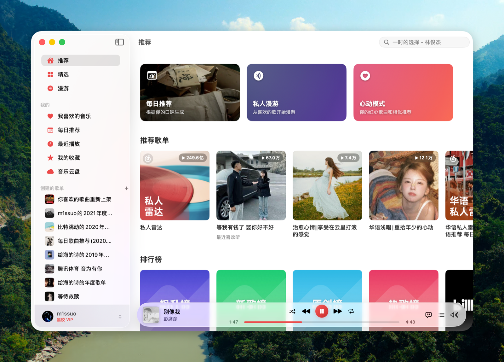
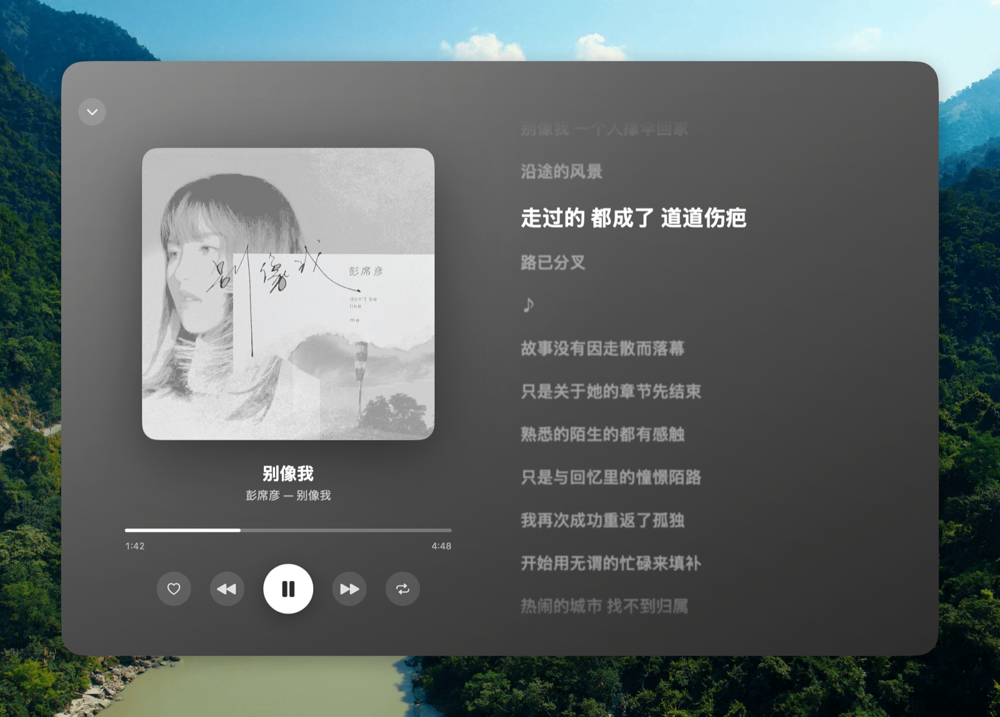
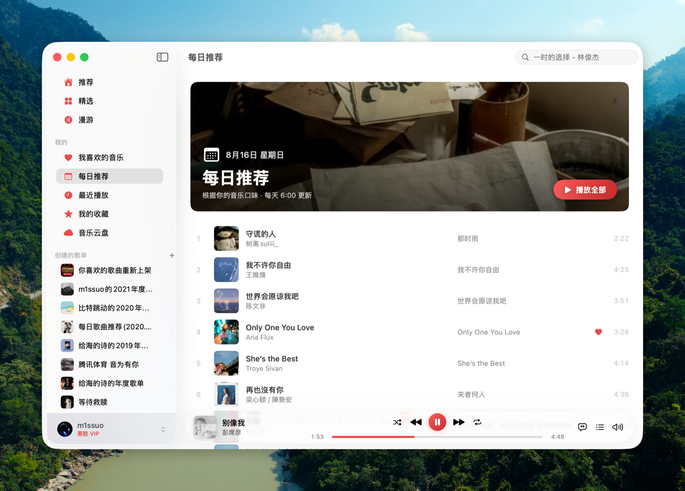
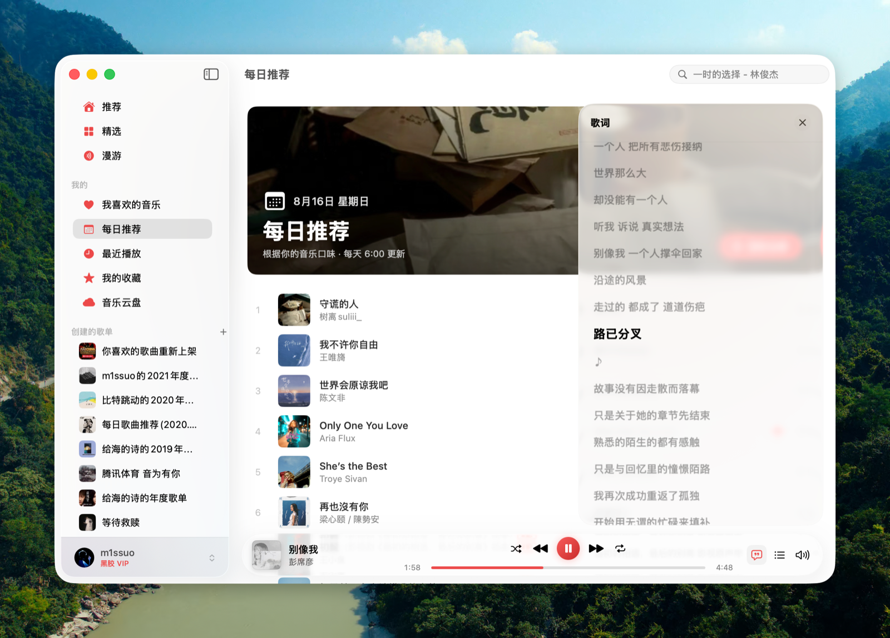

<div align="right">

**English** | [简体中文](README_CN.md)

</div>

<div align="center">


# Kumone

**雲の音 — Native macOS client for NetEase Cloud Music**

Built with SwiftUI · Talks directly to NetEase's real API · Sparkle auto-updates

[](#building)
[](Package.swift)
[](LICENSE)

<table>
  <tr>
    <td></td>
    <td></td>
  </tr>
  <tr>
    <td></td>
    <td></td>
  </tr>
</table>

</div>

## About the Name

**Kumone** comes from the Japanese **雲の音** (*kumo no ne*, "the sound of clouds"), contracted into one word — **雲音** (くもね, *kumone*). It is a nod to the "cloud" in NetEase **Cloud** Music: the music drifting down to you from the cloud.

## Features

- 🔐 **QR code login** — scan with the NetEase Cloud Music app; cookies are persisted locally and auto-refreshed
- 🏠 **Home** — daily recommendations, Personal FM, Heartbeat Mode, recommended playlists, radar playlists (Personal Radar family, personalized per account), charts, new albums, recommended artists
- 🧭 **Explore** — category playlists (curated / official / charts / mood) with infinite scrolling
- 🎵 **Playback** — AVPlayer engine, Standard to Hi-Res quality (lossless with 黑胶 VIP, automatic fallback), shuffle / repeat one / repeat all, play-next queue, gray track detection
- 🔓 **Gray track unblocking** — native implementation of UnblockNeteaseMusic's core sources (pyncmd / Kuwo / Kugou); unavailable or trial-only tracks automatically resolve from third-party sources
- 🖼 **Immersive now-playing page** — artwork-tinted gradient backdrop, large artwork, big synced lyrics (click the player-bar artwork to open, Esc to close)
- 📻 **Personal FM** — immersive roaming page with trash / skip
- 📝 **Lyrics** — glass side panel with line-synced lyrics + translation, click to seek
- 🪟 **Desktop lyrics** — LyricsX-style floating always-on-top lyric line with translation; draggable, persisted position, visible across Spaces and full-screen apps
- 📚 **Library** — liked songs, created / subscribed playlists, saved albums, followed artists, recently played, cloud disk
- ✏️ **Playlist management** — create / delete / subscribe playlists, add / remove tracks, heart songs
- 🔍 **Search** — aggregate / songs / artists / albums / playlists, trending keyword placeholder
- ⌨️ **System integration** — media keys / Control Center (Now Playing), scrobbling, playback queue restored across launches
- 🌐 **Localization** — English and Simplified Chinese, following the system language; bilingual release notes in Sparkle updates

## Installation

Requires macOS 15+ (Universal: Apple Silicon and Intel).

### Homebrew

```bash
brew install owo-network/brew/kumone --cask
```

### Manual download

Download the latest `Kumone-x.y.z.zip` from
[Releases](https://github.com/missuo/kumone/releases/latest), unzip, and drag
it into Applications.

The app is signed with a Developer ID certificate and notarized by Apple, with
built-in Sparkle automatic updates (menu bar: Kumone → Check for Updates…).

### iOS / iPadOS (sideload)

Every release ships an **unsigned** `Kumone-iOS-x.y.z.ipa` (iOS 16+). Kumone
is an unofficial client and will not be on the App Store or TestFlight, so
install it with a sideloading tool that signs the IPA with your own Apple ID —
[AltStore](https://altstore.io), [SideStore](https://sidestore.io),
[Sideloadly](https://sideloadly.io) or Xcode all work. On iOS 26+ the tab bar is the system’s native Liquid Glass; on iOS 16–25 it falls back to a simulated glass bar.

Updating: iOS apps can't replace themselves. Settings → About → **Check for
Updates** tells you when a newer release exists and links to it; download the
new IPA and reinstall with the same tool — sign-in state and settings are kept.
AltStore / SideStore can also track the release automatically via a source.

#### In-app auto-update (TrollStore only)

On a device with **[TrollStore](https://github.com/opa334/TrollStore)** (巨魔),
Kumone updates itself: Settings → About → **Check for Updates** (it also checks
on launch) downloads the new IPA with a progress ring and hands it to TrollStore
via `apple-magnifier://install?url=…` for a one-tap, fully automatic install —
the same mechanism Dopamine uses. This works **only under TrollStore**: a plain
AltStore/SideStore sideload is signed with a personal certificate and has no way
to install an IPA on-device, so there it degrades to opening the release page
for a manual re-sideload.

## Building

Requires macOS 15+ and Xcode 26+.

```bash
swift build                    # compile
Scripts/build-app.sh           # package the .app (outputs .build/app/Kumone.app)
Scripts/compile_and_run.sh     # kill → repackage → relaunch
```

## Architecture

```
Sources/Kumone/
├── Core/
│   ├── API/            # NeteaseCrypto (weapi/eapi encryption), NeteaseClient (transport + cookies), NeteaseAPI (~50 endpoints)
│   ├── Models/         # unified Track model (tolerates both JSON shapes), lyrics parser
│   ├── Player/         # PlayerService (queue / shuffle / repeat / FM / URL resolution), UnblockService, NowPlayingManager
│   └── Storage/        # AccountStore, SettingsManager, two-tier image cache
├── DesignSystem/       # design tokens, button styles (hover scale / row highlight / chips), skeletons, cards, marquee, artwork palette
└── Features/           # pages + player bar + immersive now-playing + lyrics/queue panels
```

No third-party API server involved: weapi (double AES-CBC + RSA) and eapi
(AES-ECB + MD5 digest) encryption are implemented natively in Swift, and
requests go straight to `music.163.com` / `interface.music.163.com`.

## Related projects

Want a **tvOS** build? Check out [Sonimbus](https://github.com/gee1k/sonimbus), a NetEase Cloud Music client for Apple TV maintained by my friend Svend.

## Credits

Kumone is written from scratch in Swift. No code was copied from the projects
below, but their design and implementation ideas were referenced extensively:

- [YesPlayMusic](https://github.com/qier222/YesPlayMusic) (MIT, © qier222) — feature design, NetEase API endpoints and behavior
- [kaset](https://github.com/sozercan/kaset) (MIT, © sozercan) — UI design system, motion, and SwiftPM packaging approach
- [UnblockNeteaseMusic/server](https://github.com/UnblockNeteaseMusic/server) (LGPL-3.0-only) — third-party source endpoints and matching strategy for gray tracks (`UnblockService.swift` is an independent Swift reimplementation)
- [LyricsX](https://github.com/ddddxxx/LyricsX) (MPL-2.0, © ddddxxx) — desktop lyrics window design reference (window configuration, screen-factor positioning; `DesktopLyrics.swift` is an independent SwiftUI implementation)

## License

Licensed under [LGPL-3.0-only](LICENSE) (the [GPL-3.0](COPYING) text is
included alongside). For learning and personal use only — all music data and
rights belong to NetEase Cloud Music and the respective source platforms. No
downloading, no social features.
